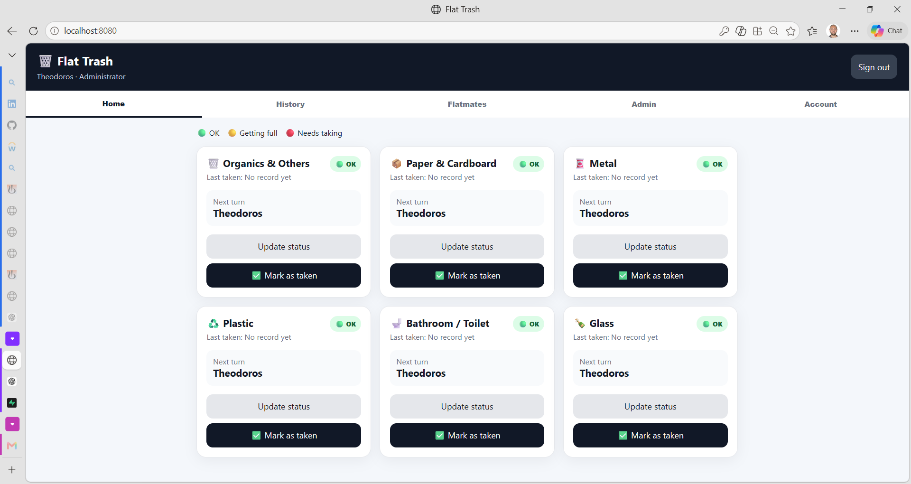
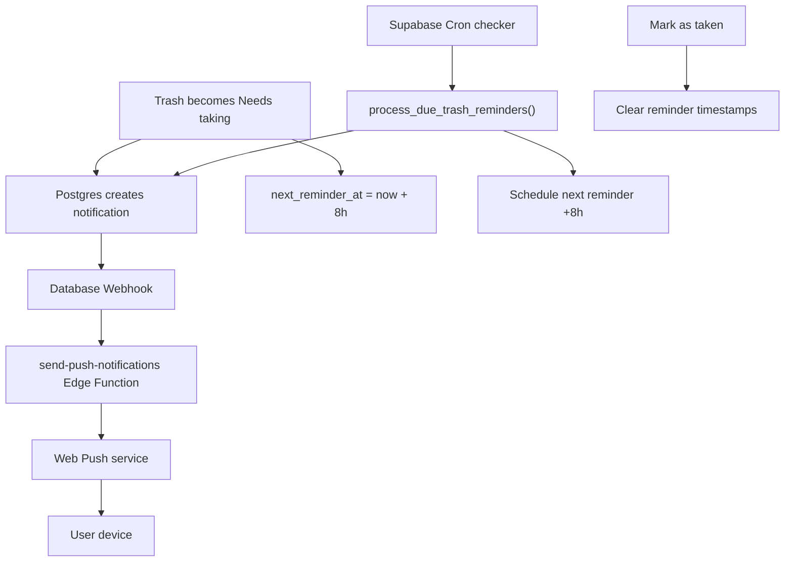
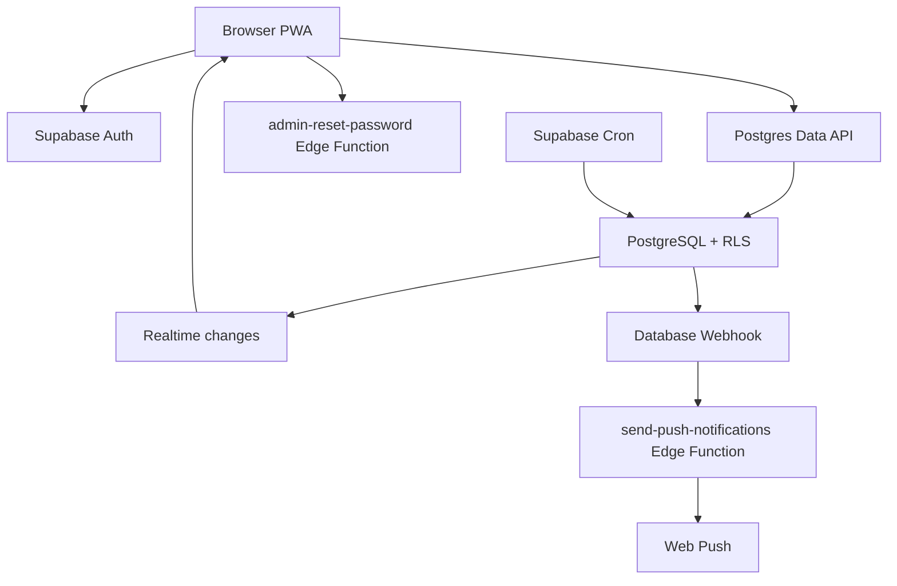

# Flat Trash

> A secure, realtime trash-rotation Progressive Web App for a three-person household, with browser push notifications and recurring reminders.

[](https://developer.mozilla.org/docs/Web/JavaScript)
[](https://supabase.com/)
[](https://web.dev/explore/progressive-web-apps)
[](LICENSE)

Flat Trash replaces informal household reminders with a shared, auditable rotation for **Theodoros**, **Prionto**, and **Camila**. Each trash category rotates independently, household members see changes in realtime, vacations are handled by reassigning turns, and notifications can reach installed/supported browsers even when the app is not open.



## Key features

- Separate username/password accounts backed by Supabase Auth
- Administrator and member roles
- Six independent trash-category rotations
- Three states: **OK**, **Getting full**, and **Needs taking**
- Realtime synchronization across devices
- Normal and voluntary trash completion with an audit trail
- Home/away availability that skips unavailable members
- In-app notification center with read/unread state
- Web Push notifications through a Supabase Edge Function
- Immediate notification when a trash category becomes **Needs taking**
- Recurring reminders approximately every 8 hours until the trash is marked as taken
- Self-service password changes
- Secure administrator password reset through a server-side Edge Function
- Installable PWA for desktop and supported mobile browsers

## Notification flow



The Cron checker may run more frequently than every eight hours. The `next_reminder_at` value is what prevents early/duplicate reminder creation and keeps each trash category on its own reminder schedule.

## Architecture



The browser receives only a Supabase publishable/anon key and a **VAPID public key**. Private credentials remain in Supabase Edge Function secrets. Row Level Security blocks anonymous table access, authenticated clients receive only the permissions required by the app, and mutations are handled through controlled PostgreSQL functions.

## Technology stack

| Layer | Technology |
|---|---|
| Frontend | HTML5, CSS3, vanilla JavaScript ES modules |
| Authentication | Supabase Auth |
| Database | PostgreSQL on Supabase |
| Authorization | Row Level Security and controlled database functions |
| Synchronization | Supabase Realtime |
| Push delivery | Web Push + VAPID |
| Server-side logic | Supabase Edge Functions (TypeScript/Deno) |
| Scheduled reminders | Supabase Cron / `pg_cron` |
| App delivery | Static hosting + Progressive Web App service worker |

## Project structure

```text
flat-trash-rotation-app/
├── index.html
├── app.js
├── styles.css
├── config.example.js
├── manifest.webmanifest
├── sw.js
├── icon-192.svg
├── icon-512.svg
├── supabase/
│   ├── schema.sql
│   ├── migrations/
│   │   ├── 20260818_add_notifications.sql
│   │   └── 20260819_add_recurring_trash_reminders.sql
│   └── functions/
│       ├── admin-reset-password/
│       │   └── index.ts
│       └── send-push-notifications/
│           └── index.ts
├── docs/screenshots/
├── SETUP.md
└── LICENSE
```

## Run your own instance

1. Create a Supabase project and the three Auth users.
2. Run `supabase/schema.sql`.
3. Enable Supabase Cron / `pg_cron`.
4. Run the SQL migrations in filename order.
5. Deploy both Edge Functions.
6. Configure VAPID and webhook secrets in Supabase.
7. Create an `INSERT` Database Webhook for `public.notifications` that calls `send-push-notifications`.
8. Copy `config.example.js` to `config.js` and add the Supabase browser values plus your VAPID public key.
9. Serve the site over HTTPS for production push/PWA use.

See [SETUP.md](SETUP.md) for the detailed procedure.

## Security notes

- Never commit passwords, database passwords, Supabase secret/service-role keys, VAPID private keys, or webhook secrets.
- `config.js` is intentionally excluded by `.gitignore`.
- `config.example.js` contains placeholders only.
- The VAPID **public** key is safe to expose to the browser; the VAPID **private** key stays in Supabase secrets.
- The `send-push-notifications` function checks a dedicated `x-webhook-secret` header before processing a database webhook.
- A Supabase publishable/anon key is intended for client use only with correctly configured Row Level Security and least-privilege grants.
- Existing passwords are never readable; the administrator can only replace a forgotten password with a new temporary password.

## Author

**Theodoros Liatsis** — [Teodor4style](https://github.com/Teodor4style)

## License

This project is available under the [MIT License](LICENSE).
