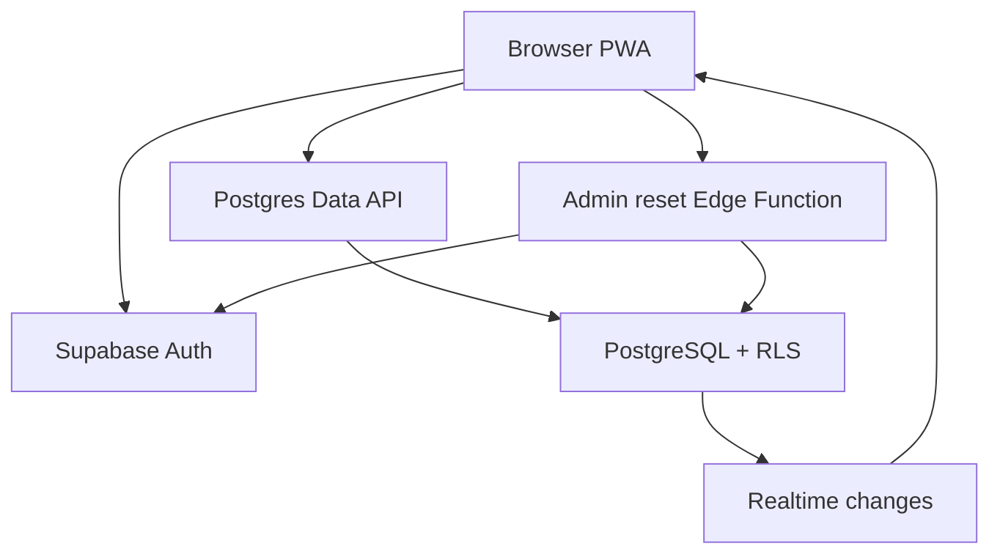

# Flat Trash

> A secure, realtime trash-rotation Progressive Web App for a three-person household.

[](https://developer.mozilla.org/docs/Web/JavaScript)
[](https://supabase.com/)
[](https://web.dev/explore/progressive-web-apps)
[](LICENSE)

Flat Trash replaces informal reminders with a shared, auditable rotation for **Theodoros**, **Prionto**, and **Camila**. Each trash category rotates independently, household members see changes in realtime, and voluntary substitutions are preserved in the activity history.


## Key features

- Separate username/password accounts backed by Supabase Auth
- Administrator and member roles
- Six independent trash-category rotations
- Three states: **OK**, **Getting full**, and **Needs taking**
- Realtime synchronization across devices
- Normal and voluntary trash completion with an audit trail
- Home/away availability that skips unavailable members
- Self-service password changes
- Secure administrator password reset through a server-side Edge Function
- Installable PWA for desktop, Android, and iPhone

## Architecture



The browser receives only a Supabase **publishable key**. Row Level Security blocks anonymous table access, authenticated clients receive read-only table access, and all mutations pass through controlled PostgreSQL functions. The privileged password-reset operation runs server-side and verifies that the caller is the household administrator.

## Technology stack

| Layer | Technology |
|---|---|
| Frontend | HTML5, CSS3, vanilla JavaScript ES modules |
| Authentication | Supabase Auth |
| Database | PostgreSQL on Supabase |
| Authorization | Row Level Security and controlled database functions |
| Synchronization | Supabase Realtime |
| Server-side logic | Supabase Edge Functions (TypeScript/Deno) |
| App delivery | Static hosting and Progressive Web App service worker |

## Project structure

```text
flat-trash-rotation-app/
├── index.html
├── app.js
├── styles.css
├── config.example.js
├── manifest.webmanifest
├── sw.js
├── icon-192.svg
├── icon-512.svg
├── supabase/
│   ├── schema.sql
│   └── functions/admin-reset-password/index.ts
├── docs/screenshots/
├── SETUP.md
└── LICENSE
```

## Run your own instance

1. Create a Supabase project and three Auth users.
2. Run [`supabase/schema.sql`](supabase/schema.sql).
3. Deploy the `admin-reset-password` Edge Function.
4. Copy `config.example.js` to `config.js` and add your Supabase URL and publishable key.
5. Serve the folder through a local web server or static host.

Detailed instructions are available in [SETUP.md](SETUP.md).

## Security notes

- No passwords, database passwords, secret keys, or `service_role` keys belong in this repository.
- `config.js` is intentionally excluded by `.gitignore`.
- A Supabase publishable key is suitable for browser use only when RLS and least-privilege policies are correctly configured.
- Existing passwords are never readable; the administrator can only replace a forgotten password with a temporary one.

## Author

**Theodoros Liatsis** — [Teodor4style](https://github.com/Teodor4style)

## License

This project is available under the [MIT License](LICENSE).
